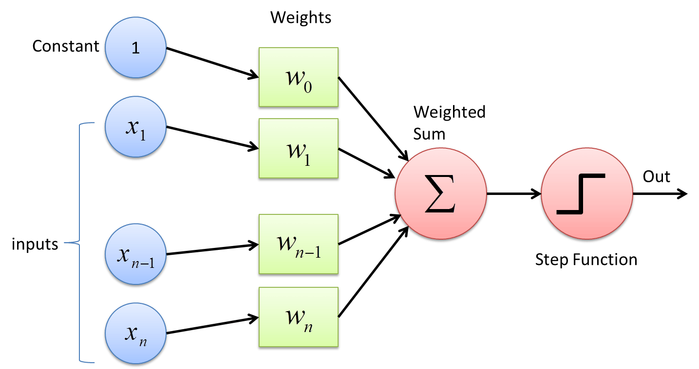
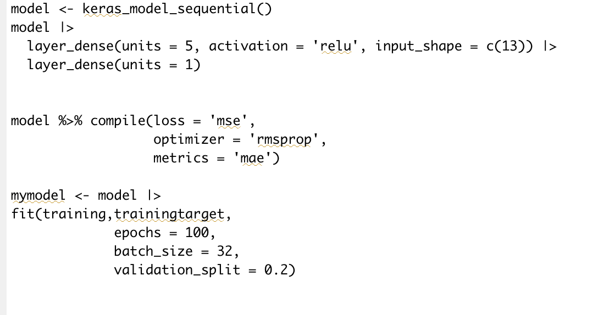
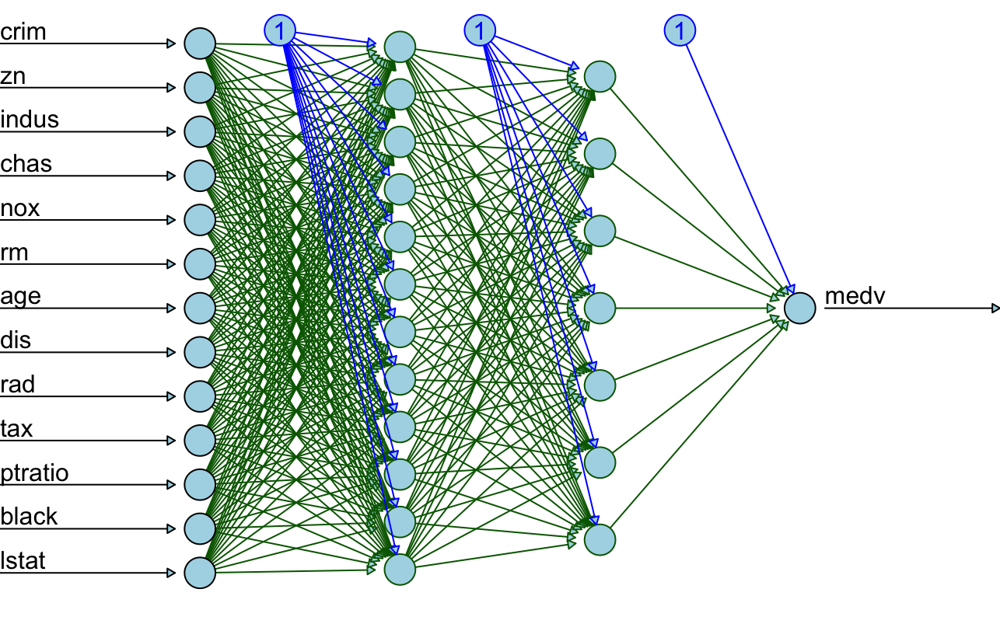
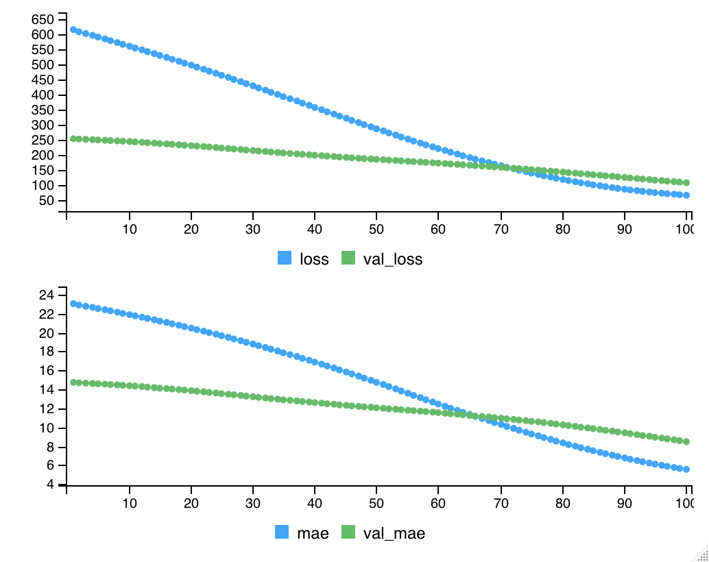

```{r setup, include=FALSE}
knitr::opts_chunk$set(echo = FALSE)
```

```{r cars, include=FALSE, echo = FALSE}
library(MASS)
library(keras)
library(mlbench)
library(dplyr)
library(magrittr)
library(neuralnet)

data <- Boston
str(data)
data %<>% mutate_if(is.factor, as.numeric)


n <- neuralnet(medv ~ .,
               data = data,
               hidden = c(12,7),
               linear.output = F,
               lifesign = 'full',
               rep=1)
```

```{r, include=FALSE, echo = FALSE}
set.seed(445)
ind <- sample(2, nrow(data), replace = T, prob = c(.7, .3))
training <- data[ind==1,1:13]
test <- data[ind==2, 1:13]
trainingtarget <- data[ind==1, 14]
testtarget <- data[ind==2, 14]


m <- colMeans(training)
s <- apply(training, 2, sd)
training <- scale(training, center = m, scale = s)
test <- scale(test, center = m, scale = s)

```

```{r, include=FALSE, echo = FALSE}
model <- keras_model_sequential()
model |>
  layer_dense(units = 5, activation = 'relu', input_shape = c(13)) |>
  layer_dense(units = 1)


model %>% compile(loss = 'mse',
                  optimizer = 'rmsprop', 
                  metrics = 'mae') 

mymodel <- model |>          
fit(training,trainingtarget,
             epochs = 100,
             batch_size = 32,
             validation_split = 0.2)
```

## What is a Deep Neural Network 

-   Computers learn to process data in a way that mimics the human brain. 
-   Neural networks are made of layered neurons
-   Can work with a large volume of data

**Examples of the Use of Neural Networks** 

* Computer Vision
    + Facial Recognition
    + Object Detection
*   Speech Recognition
    + Amazon Alexa
    + Voice Transcription
*   Natural Language Processing


## How Do Neural Networks Work
1.  Input
2.  Hidden Layers
3.  Output Layer

```{r, echo=FALSE, out.height="70%", out.width="70%"}

```

## Boston: Predicting Median Value of Owner Occupied Homes
-   14 Features, including the outcome variable
-   506 Rows

```{r, echo=FALSE, out.width="100%"}

```

## Visual of Neural Network on the Boston Dataset

```{r, include=FALSE, echo = FALSE}
plot(n,col.hidden = 'darkgreen',
     col.hidden.synapse = 'darkgreen',
     show.weights = F,
     information = F,
     fill = 'lightblue')
```

```{r, echo=FALSE, out.width="100%"}

```

## Training a Neural Network

```{r, echo=FALSE, out.width="100%"}

```


## Test Set Results

```{r}
#model %>% evaluate(test, testtarget)
pred <- model %>% predict(test)
paste("Mean Squared Error: ", mean((testtarget-pred)^2))
plot(testtarget, pred, xlab=" Ground Truth", ylab="Predicted Value",
     main="Median value of owner-occupied homes in $1000s") 
```

## Hyperparameter Tuning
*   Loss Functions
*   Optimization Functions
*   Activation Functions
*   Other tuneable parameters
    + Training Epochs
    + Batch Size
*   Network Architecture
    + Hidden Layers
    + Neuron Connections

## Pros and Cons

:::::::::::::: {.columns}
::: {.column}
Pros

* Can be trained on large amounts of data 
* Effective at certain tasks
* Less need for feature engineering
:::
::: {.column}
Cons

* Less interpretable
* Requires large amount of processing power
* Overfitting
* Potential for introducing biases from the real world 
:::
::::::::::::::          

## Conclusion

*   Many Applications
*   More research
    + Capabilities
    + Problems
*   Libraries and existing architectures help their development
